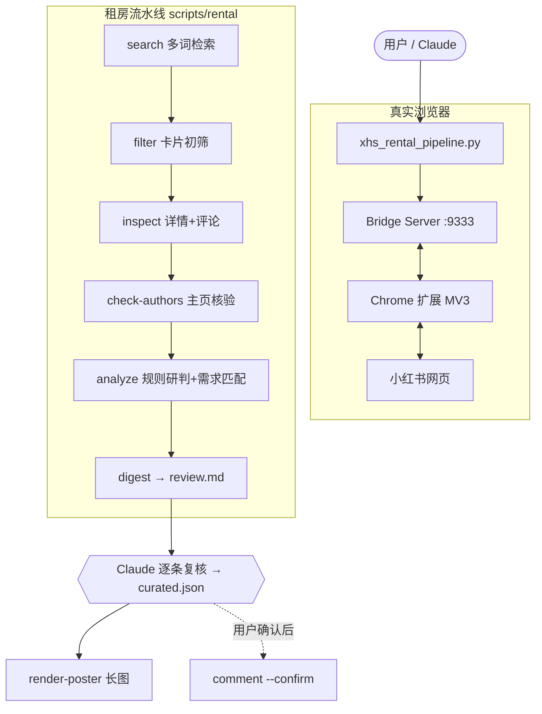

# 🏡 xhs-rental-hunter: 小红书个人整租转租猎人与防中介/串串房避坑技能

[](https://www.python.org/downloads/)
[](LICENSE)
[](#2-chrome-扩展加载)
[](#-接入-claude--agent-工作流)

**xhs-rental-hunter** 是专为小红书租房场景设计的 Agent Skill 与自动化流水线。

通过 **Chrome 扩展 + 本地 WebSocket Bridge** 驱动你已登录的真实浏览器，自动检索房源帖、抓取正文与实拍图、
核验发帖人主页，用**带证据的规则引擎**做初判，再由 Claude 逐条复核，最后生成带房间实拍图的长图报告。

> **v2 的核心变化**：脚本做机械活（检索、抓取、抽取、初判、画图），Claude 做判断（读原文、看主页、看口吻）。
> 每一条“加分/扣分”都附带原文片段，用户和 Claude 都能看到“为什么这么判”。

---

## 🌟 核心功能

1. **🛡️ 四条鉴别法则**（详见 [references/anti-agent-rules.md](references/anti-agent-rules.md)）
   * **人设包装 + 劣质翻新**：职业人设昵称只在与多套房历史/全新装修同时出现时才算强信号，避免误伤；
   * **多套房历史与中介话术**：真正访问发帖人主页，统计历史房源帖数量；识别收中介费、“房源多”“加 v”等话术；
   * **模板化营销文案**：三竖杠标题、emoji 过量、正文空洞；同时识别真实租客的具体细节（转租原因、合同期限、直签房东、家具转让、主动说缺点）；
   * **人设与口吻不一致**：交给 Claude 读原文判断（规则引擎不做刻板印象判断）。

2. **🔍 结构化抽取（城市无关）**
   * 月租（区分押金/中介费/水电物业/年份/线路号，支持 `4.5k`、`4200-4800`、全角数字、千分位）；
   * 户型、面积、押几付几、合同剩余期限、可入住时间、地铁信息；
   * 评论区线索：作者回复“已租出”自动排除，有人质疑“又是中介”自动标记。

3. **🎯 需求匹配**：预算、户型、发布时效、区域关键词；不符合的标注原因而不是静默丢弃，被排除的帖子也单独列出供核对误杀。

4. **📊 长图报告**：跨平台中文字体自动发现、按像素换行不溢出、卡片高度自适应、实拍图等比裁切；可直接吃 Claude 写的 `curated.json`。

5. **🧯 稳妥运行**：详情与主页缓存、断点续跑；遇到小红书人工验证立即停止并保留进度（退出码 3）；
   评论默认只预览，必须 `--confirm` 才发送，且自动去重。

---

## 📸 报告效果预览

<p align="center">
  
</p>

---

## 🏗️ 架构



---

## 🚀 快速上手

### 1. 安装依赖

```bash
git clone https://github.com/KardeniaPoyu/xhs-rental-hunter.git
cd xhs-rental-hunter
uv sync            # 或 pip install -e .
```

### 2. Chrome 扩展加载

1. 打开 `chrome://extensions/`，开启右上角 **开发者模式**；
2. **加载已解压的扩展程序**，选择本项目的 [`extension/`](extension/) 目录；
3. 在 Chrome 中登录小红书 (`https://www.xiaohongshu.com`)。

### 3. 自检

```bash
uv run python scripts/xhs_rental_pipeline.py doctor   # 检查 bridge / 扩展 / 中文字体
uv run python scripts/cli.py check-login              # 未登录会生成二维码；会自动拉起 bridge
```

---

## 💻 命令行

### 一键流程（不含评论）

```bash
uv run python scripts/xhs_rental_pipeline.py run-all \
  --keywords "东坝 整租 转租" "褡裢坡 一居 转租" "朝阳 个人转租 整租" \
  --budget-min 3500 --budget-max 5000 --bedrooms 一居 两居 \
  --max-age-days 30 --area-keywords 东坝 褡裢坡 \
  --limit 15 --author-limit 8
```

产物都在 `./rental_work/`：`review.md`（复核材料）、`analyzed_results.json`（研判结果与证据）、`rental_report.png`（长图）。

### 分步执行

| 命令 | 作用 |
|---|---|
| `search --keywords ...` | 多关键词检索（默认“最新”、仅图文），结果累积去重 |
| `filter` | 卡片级初筛，排除项写入 `excluded_feeds.json` |
| `inspect --limit 15` | 抓取详情、图片与首屏评论（缓存于 `notes/`） |
| `check-authors --limit 8` | 访问发帖人主页，统计历史房源帖（缓存于 `authors/`） |
| `analyze [需求参数]` | 规则研判 + 需求匹配 |
| `digest` | 生成 `review.md` |
| `render-poster [--curated-file] [--title]` | 渲染长图，优先使用 `curated.json` |
| `comment --ids ... --message ... [--confirm]` | 默认仅预览；`--confirm` 才发送 |

所有子命令支持 `--work-dir`、`--delay MIN MAX`。stdout 最后一行为 JSON 摘要；
退出码 `0` 成功、`2` 错误、`3` 需要在浏览器中完成人工验证。

### Claude 复核后出图

把精选结果写入 `rental_work/curated.json`（格式见 [references/curated-schema.md](references/curated-schema.md)），然后：

```bash
uv run python scripts/xhs_rental_pipeline.py render-poster --title "北京朝阳 · 东坝个人整租精选"
```

海报中文字体会自动查找（微软雅黑 / 苹方 / Noto Sans CJK / 文泉驿），也可用 `XHS_FONT=/path/to/font.ttc` 指定。

---

## 🤖 接入 Claude / Agent 工作流

将仓库放到 Claude Code 的 skills 目录（或直接在仓库内使用），Claude 会按 [`SKILL.md`](SKILL.md) 工作：
确认需求 → 生成关键词 → 跑流水线 → **读 review.md 逐条复核** → 写 curated.json → 出图 → 交付结论与看房追问清单。
评论等以用户账号对外发出的操作，Claude 会先预览并等你明确同意。

---

## 🛡️ 线下看房三条铁律

1. **核验转租人确实住在这里**：请对方出示近 3~6 个月本人名下的水电燃气缴费记录，或该地址的快递/外卖订单。
2. **直签房东、钱给房东**：见房东本人，核对房产证与身份证原件；押金和租金只转入房东同名账户。
3. **警惕串串房**：进门关窗 3 分钟闻气味，看踢脚线、柜体是否为廉价颗粒板或新贴地板革；新装修可要求甲醛检测报告。

---

## 📁 目录结构

```
xhs-rental-hunter/
├── SKILL.md                    # Skill 主文件（Claude 工作流）
├── references/                 # 按需加载的参考：鉴别法则、curated.json 格式
├── scripts/
│   ├── xhs_rental_pipeline.py  # 租房流水线 CLI
│   ├── rental/                 # 抽取 / 规则 / 编排 / 复核摘要 / 海报（除 pipeline 外均可离线测试）
│   ├── cli.py                  # 底层小红书 CLI（登录、搜索、详情、评论、发布…）
│   ├── bridge_server.py        # WebSocket 桥接服务
│   └── xhs/                    # 浏览器自动化核心库
├── extension/                  # Chrome 扩展 (MV3)
├── skills/                     # 子技能（xhs-rental-hunter 与根 SKILL.md 保持同步）
├── tests/                      # pytest（含离线端到端测试与 fixtures）
└── assets/example_report.png
```

## 🧪 开发

```bash
uv sync --extra dev
uv run pytest            # 全部离线运行，不需要浏览器
uv run ruff check scripts/rental scripts/xhs_rental_pipeline.py tests
```

修改根目录 `SKILL.md` 后，同步子技能：

```bash
sed -e 's#](references/#](../../references/#g' \
    -e 's#所有命令在本 Skill 根目录执行。#所有命令在仓库根目录执行（本文件与根目录 SKILL.md 内容一致）。#' \
    SKILL.md > skills/xhs-rental-hunter/SKILL.md
```

## 📄 许可证

[MIT License](LICENSE)。请合理使用：仅为个人找房抓取少量必要信息，遵守小红书用户协议，不要公开传播他人主页信息。
