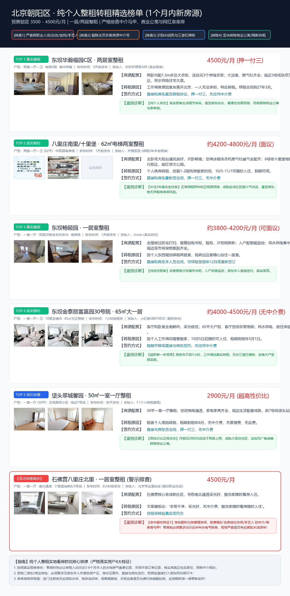
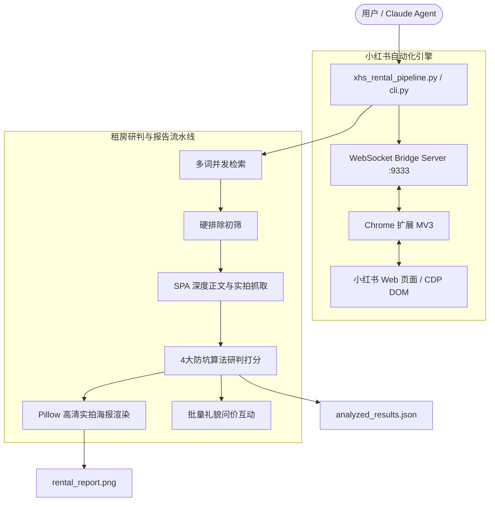

# 🏡 xhs-rental-hunter: 小红书个人整租转租猎人与防中介/串串房避坑技能

[](https://www.python.org/downloads/)
[](LICENSE)
[](#-chrome-扩展加载)
[](#-接入-claude--agent-工作流)

**xhs-rental-hunter** 是专为小红书租房场景设计的自动化 Agent Skill 与工程流水线。

通过 **Chrome 扩展 + 本地 WebSocket Bridge** 驱动真实已登录浏览器，它不仅打包了小红书全链路自动化操作能力（检索、详情抓取、实拍图下载、自动跟进问价、点赞收藏），更搭载了独创的 **4 大防中介与防串串房研判引擎**。帮助你自动剔除职业中介马甲、商业公寓、合租隔断与甲醛串串房，并一键生成带房间实拍图的高清长图调研报告。

---

## 🌟 核心功能亮点

1. **🛡️ 4 大防中介与防串串房鉴别法则**
   * **排查假职业人设**：识别伪装成化妆师、宝妈、作家、手作人、理发师但收藏夹全是房源的串串房高危账号；
   * **多套房源历史筛查**：自动识别文案标榜“个人转租”但主页有多套跨区域房源历史的职业中介马甲；
   * **AI 润色与三竖杠模板识别**：排查标题三竖杠（`北京个人转租｜0中介费｜xx小区`）与致死量 emoji 虚假营销帖；
   * **坚决排除假整租与商业公寓**：自动过滤商业公寓（Loft、产业园商住、商水商电）、合租单间、求租贴。

2. **🔍 自动化租房流水线 (`xhs_rental_pipeline.py`)**
   * **多词并发检索**：针对目标区域、商圈、户型多关键词并行检索与聚合去重；
   * **硬规则智能初筛**：快速剔除求租、已出、公寓与合租标签；
   * **SPA 深度正文勘查**：进入详情页抓取完整描述、真实租金、发帖人背景、看房作息与全套实拍照片；
   * **置信度智能打分**：基于真实租客特征（工作调动原因、租期时长、自留家具赠送、直签房东证明）量化评分。

3. **📊 高清可视化实拍长图报告 (`render-poster`)**
   * 自动下载候选房源的高清实拍房间照片（卧室、客厅、厨房、卫生间）；
   * 自动排版并渲染 **1260px** 现代信息图海报（包含配置、签约方式、转租原因与专栏鉴别诊断）。

4. **💬 自动化跟进与多轮互动 (`comment`)**
   * 支持一键对高可信度真实房源批量发送“礼貌问价”评论；
   * 支持针对单篇帖子的精准发表评论、评论区多轮互动与回复他人；
   * 支持点赞与收藏。

5. **🌐 免逆向原生风控对策**
   * 采用 Chrome 扩展方案，在用户日常登录的真实浏览器上下文执行；
   * 无需逆向 x-s/x-t 签名加密算法，自带真实用户设备指纹，稳定抗风控。

---

## 📸 生成报告效果预览

运行 `render-poster` 或 `run-all` 后自动生成的实拍长图报告（示例展示朝阳区 3500-4500 元整租精选与排查案例）：

<p align="center">
  
</p>

---

## 🏗️ 架构设计



---

## 🚀 快速上手

### 1. 环境准备与依赖安装

推荐使用 Python 3.11+ 以及 [uv](https://github.com/astral-sh/uv) 或 pip：

```bash
# 克隆仓库
git clone https://github.com/KardeniaPoyu/xhs-rental-hunter.git
cd xhs-rental-hunter

# 使用 uv 安装
uv sync

# 或使用 pip
pip install -e .
```

### 2. Chrome 扩展加载

1. 在 Chrome 浏览器打开 `chrome://extensions/`；
2. 开启右上角 **“开发者模式” (Developer mode)**；
3. 点击 **“加载已解压的扩展程序” (Load unpacked)**，选择本项目中的 [`extension/`](extension/) 目录；
4. 确保扩展已启用，且浏览器已登录小红书账号 (`https://www.xiaohongshu.com`)。

### 3. 启动 Bridge Server

在后台终端启动本地桥接服务（默认端口 9333）：

```bash
python scripts/bridge_server.py
```

终端显示 `server listening on 127.0.0.1:9333` 且扩展连接成功后即可进行自动化调用。

### 4. 验证登录状态

```bash
python scripts/cli.py check-login
```

返回 `{"logged_in": true, ...}` 即表示就绪。

---

## 💻 命令行使用手册

### ⚡ 方式一：一键全流程执行 (推荐)

直接输入目标商圈、户型关键词与抓取数量，自动完成检索、初筛、详情勘查、防坑打分与海报渲染：

```bash
python scripts/xhs_rental_pipeline.py run-all \
  --keywords "朝阳区 一居室 整租 转租" "东坝 整租 转租" "姚家园 整租 转租" \
  --limit 20 \
  --output-png "./rental_report.png"
```

### 🛠️ 方式二：分步精准控制

```bash
# 步骤 1：多词并发检索
python scripts/xhs_rental_pipeline.py search \
  --keywords "石佛营 整租 转租" "姚家园 整租 转租" "东坝 整租 转租"

# 步骤 2：初筛排除求租/合租/公寓
python scripts/xhs_rental_pipeline.py filter \
  --raw-file "./rental_work/raw_feeds.json"

# 步骤 3：深度抓取正文、租金与实拍图片
python scripts/xhs_rental_pipeline.py inspect \
  --filtered-file "./rental_work/filtered_feeds.json" \
  --limit 15

# 步骤 4：执行 4 大防坑研判算法
python scripts/xhs_rental_pipeline.py analyze \
  --detailed-file "./rental_work/detailed_posts.json"

# 步骤 5：渲染房间实拍长图海报
python scripts/xhs_rental_pipeline.py render-poster \
  --analyzed-file "./rental_work/analyzed_results.json" \
  --output "./rental_report.png"

# 步骤 6：批量跟进评论（自动带防风控间隔）
python scripts/xhs_rental_pipeline.py comment \
  --analyzed-file "./rental_work/analyzed_results.json" \
  --message "礼貌问价，请问方便了解下租金和起租日吗？" \
  --top-n 3
```

### 💬 通用小红书互动命令

```bash
# 针对单篇帖子发表自定义评论
python scripts/cli.py post-comment --feed-id <FEED_ID> --xsec-token <TOKEN> --content "请问房子还在吗？"

# 回复评论区指定用户
python scripts/cli.py reply-comment --feed-id <FEED_ID> --xsec-token <TOKEN> --comment-id <COMMENT_ID> --content "已私信您～"

# 点赞与收藏
python scripts/cli.py like-feed --feed-id <FEED_ID> --xsec-token <TOKEN>
python scripts/cli.py favorite-feed --feed-id <FEED_ID> --xsec-token <TOKEN>
```

---

## 🤖 接入 Claude / Agent 工作流

### 作为 Claude Code Skill
本项目完全符合 Claude Code Skill 规范。在 Claude Code 中只需将本仓库目录置于配置的 skills 路径下，或直接通过 [`SKILL.md`](SKILL.md) 引导 Claude：

* [`SKILL.md`](SKILL.md)：Skill 主元数据与工作流定义；
* [`CLAUDE.md`](CLAUDE.md)：开发与代码规范；
* [`CLAUDE_PROMPT.md`](CLAUDE_PROMPT.md)：网页版 Claude / ChatGPT 可直接粘贴使用的 System Prompt。

---

## 🛡️ 纯个人整租实地看房防坑 3 铁律

1. **查验近半年真实生活缴费流水**：
   看房见面时，要求转租人当面出示该房屋过去 3~6 个月的**水电气暖缴费凭据、外卖买菜订单记录**。假借租客身份的中介皮下男根本无法提供连续的历史账单。
2. **严禁二房东/商业转包**：
   签约前必须见到**房屋产权人（房东）本人**，当面核对房产证原件与身份证原件，押金和租金必须直接转入房东同名银行账户。
3. **串串房甲醛与气味警惕**：
   进门先紧闭门窗 3 分钟，留意有无刺鼻劣质黏胶味或油漆味；敲击墙壁踢脚线、观察橱柜边缘是否为最廉价的拼装颗粒板或刚贴不久的地板革。有异味一律果断放弃。

---

## 📁 目录结构

```
xhs-rental-hunter/
├── assets/                     # 示例海报等静态资源
│   └── example_report.png
├── extension/                  # Chrome 浏览器扩展源码 (MV3)
│   ├── manifest.json
│   ├── background.js
│   ├── content.js
│   └── popup.html
├── scripts/                    # Python 核心执行脚本
│   ├── bridge_server.py        # WebSocket 桥接服务
│   ├── cli.py                  # 统一底层 CLI 入口
│   ├── xhs_rental_pipeline.py  # 租房全流程自动化流水线
│   └── xhs/                    # 模块化核心库 (CDP/评论/搜索/详情等)
├── skills/                     # Claude Code 子技能目录
│   └── xhs-rental-hunter/      # 租房猎人专用 SKILL.md
├── tests/                      # 测试用例
├── CLAUDE.md                   # Claude 协作指令
├── CLAUDE_PROMPT.md            # Claude System Prompt 模板
├── LICENSE                     # MIT 开源协议
├── pyproject.toml              # 项目配置与依赖说明
├── README.md                   # 项目主说明文档
└── SKILL.md                    # 根目录 Skill 定义
```

---

## 📄 许可证

本项目遵循 [MIT License](LICENSE) 开源。
